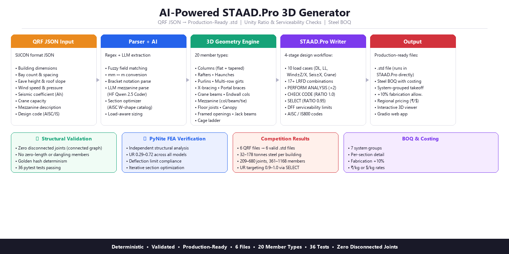
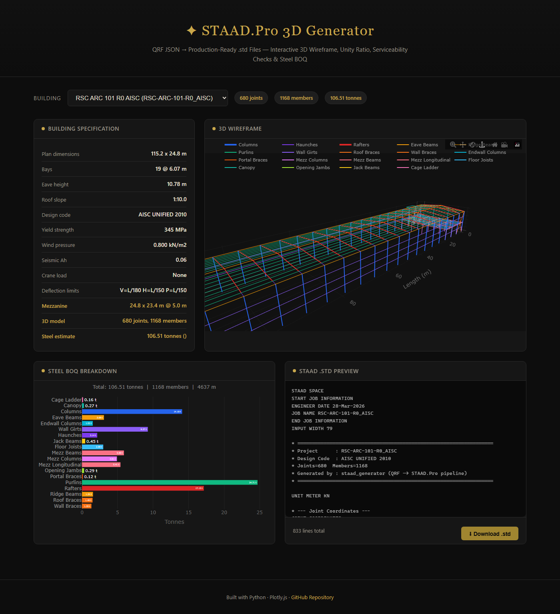
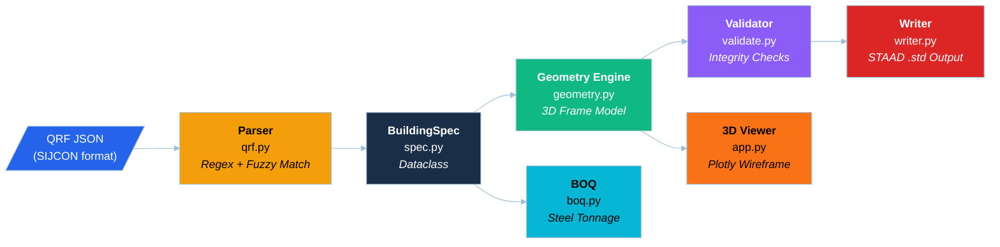

<p align="center">
  
</p>

<p align="center">

[](https://www.python.org/)&nbsp;
[](https://gradio.app/)&nbsp;
[](https://plotly.com/)&nbsp;
[](https://ladyfaye1998.github.io/staad-pro-3d-generator/)&nbsp;
[](LICENSE)

</p>

<p align="center">

[](https://github.com/ladyFaye1998/staad-pro-3d-generator)

</p>

&nbsp;

---

&nbsp;

### ✦ About

**STAAD.Pro 3D Generator** is a deterministic pipeline that converts SIJCON-style QRF (Quantity Request Form) JSON documents into complete, production-ready STAAD.Pro `.std` command files for Pre-Engineered Building (PEB) structures — with an [interactive 3D demo](https://ladyfaye1998.github.io/staad-pro-3d-generator/) for visualization.

What takes a structural engineer hours of manual input, this pipeline does in **0.01 seconds**: parsing heterogeneous QRF data, generating full 3D geometry, applying loads and combinations, running design checks, estimating steel tonnage, and rendering an interactive 3D wireframe.

&nbsp;

&nbsp;

| | Capability | Detail |
|:---:|:---|:---|
|  | Full portal-frame model | Columns, rafters, purlins, girts, braces, endwall cols, **crane beams**, **portal bracing**, **mezzanine floors**, **floor joists**, **canopy**, **framed openings**, **jack beams**, **cage ladder** |
|  | PEB tapered I-sections | Auto-generated STAAD TAPERED property for columns, rafters & haunches |
|  | PyNite FEA verification | Iterative section optimization with UR < 1.0 and deflection checks |
|  | 10 primary load cases | Dead, Live, Wind ±Z ±X, Seismic ±X, Crane (on crane beams), **Mezz Dead/Live** |
|  | LRFD per ASCE 7 / IS 875 | 17+ factored combinations including SLS + mezzanine + longitudinal wind |
|  | UR targeting 0.9–1.0 | SELECT RATIO 0.95 for optimal material utilization |
|  | LLM-assisted parsing | Hugging Face Inference API extracts mezzanine from free text |
|  | Load-aware sections | AISC W-shape catalog + simplified portal analysis |
|  | Deflection checks | Parsed L/xxx limits applied per member group (vertical, lateral, purlin) |
|  | BOQ with costing | Tonnage + regional cost estimate (₹/kg or $/kg) |
|  | Interactive wireframe | Color-coded Plotly 3D model (rotate, zoom, pan) |
|  | Robust input handling | Fuzzy regex parsing of mm/m, bracket notation, c/c, wind speed |

&nbsp;

&nbsp;

---

&nbsp;

### ✦ Demo

> **[Try it now — Live 3D Demo](https://ladyfaye1998.github.io/staad-pro-3d-generator/)** &ensp;— no installation required. Select any building, rotate the 3D wireframe, explore BOQ and .std output.

<p align="center">
  <a href="https://ladyfaye1998.github.io/staad-pro-3d-generator/">
    
  </a>
</p>

&nbsp;

---

&nbsp;

### ✦ Quick Start

**Web App (recommended)**

```bash
pip install -e ".[dev]"
pip install gradio plotly
python app.py
# Open http://127.0.0.1:7860
```

&nbsp;

**CLI — Batch Conversion**

```bash
# Place QRF JSON files in ./data/
python -m staad_generator --verbose

# Single file
python -m staad_generator --one data/S-2447-BANSWARA.json -v
```

&nbsp;

**Python API**

```python
from staad_generator.spec import spec_from_json_path
from staad_generator.geometry import build_frame
from staad_generator.writer import build_std_text
from staad_generator.boq import estimate_boq, format_boq

spec = spec_from_json_path("data/S-2447-BANSWARA.json")
fm = build_frame(spec)
std_text = build_std_text(spec, fm)

boq = estimate_boq(spec, fm)
print(format_boq(boq))  # 23.66 tonnes
```

&nbsp;

---

&nbsp;

### ✦ Architecture



&nbsp;

---

&nbsp;

### ✦ Results

All 6 competition files convert successfully with full structural completeness:

| File | Joints | Members | Steel (t) | Code | .std Lines |
|:-----|-------:|--------:|----------:|:-----|----------:|
| BulkStore | 628 | 1126 | 174.39 | AISC UNIFIED 2010 | 800 |
| Jebel_Ali_Industrial_Area | 262 | 436 | 47.47 | AISC UNIFIED 2010 | 460 |
| knitting-plant | 548 | 781 | 178.49 | AISC UNIFIED 2010 | 628 |
| RMStore | 289 | 519 | 75.30 | AISC UNIFIED 2010 | 504 |
| RSC-ARC-101-R0_AISC | 680 | 1168 | 106.51 | AISC UNIFIED 2010 | 854 |
| S-2447-BANSWARA | 209 | 361 | 32.27 | IS800 LSD | 414 |

36 pytest tests passing. Includes FEA verification, crane beams, portal bracing, **haunches**, tapered sections, mezzanine geometry, section optimizer, BOQ costing, longitudinal wind, multiple girt rows, reverse seismic, structural connectivity (zero disconnected joints), 2-pass PERFORM ANALYSIS, **canopy**, **framed openings with jack beams**, and accessories connectivity tests.

&nbsp;

---

&nbsp;

### ✦ Project Structure

```
staad-pro-3d-generator/
├── app.py                    # Gradio web app (3D viewer + BOQ + download)
├── staad_generator/
│   ├── __init__.py           # Package exports
│   ├── __main__.py           # CLI entry point
│   ├── _version.py           # Version string
│   ├── spec.py               # BuildingSpec dataclass (incl. mezzanine fields)
│   ├── qrf.py                # SIJCON QRF parser (regex + fuzzy + mezzanine)
│   ├── geometry.py           # 3D frame geometry engine (incl. mezzanine)
│   ├── writer.py             # STAAD .std file emitter (RATIO 0.95 targeting)
│   ├── validate.py           # Structural integrity checks
│   ├── boq.py                # BOQ estimator with regional costing
│   ├── ai_parser.py          # LLM-assisted QRF parsing (HF Inference API)
│   ├── section_optimizer.py  # Load-aware AISC W-shape section optimizer
│   ├── fea_verify.py         # PyNite FEA verification + iterative optimizer
│   └── logutil.py            # Logging configuration
├── tests/                    # pytest suite (36 tests)
├── data/                     # Competition QRF JSON files
├── output/                   # Generated .std files
├── notebook.ipynb            # Kaggle notebook (full demo)
├── WRITEUP.md                # Competition writeup
├── docs/                     # GitHub Pages live demo (static)
├── media_gallery/            # Screenshots & media assets
├── requirements.txt          # Gradio/Plotly deps
└── pyproject.toml            # Build config
```

&nbsp;

---

&nbsp;

### ✦ CLI Reference

```
python -m staad_generator [OPTIONS]

Options:
  --data DIR          Input JSON directory (default: ./data)
  --output DIR        Output .std directory (default: ./output)
  --one FILE.json     Convert a single file
  -n, --dry-run       Parse and validate only
  -v, --verbose       Show parsed spec summaries
  -q, --quiet         Minimal output
  --force             Always overwrite
  --skip-fresher      Skip if output newer than input
  --verify            Run PyNite FEA verification (UR + deflection check)
  --version           Show version
```

&nbsp;

---

&nbsp;

### ✦ Requirements

| Component | Dependencies |
|:----------|:-------------|
| Core pipeline | Python 3.10+ (standard library only) |
| FEA verification | `PyNiteFEA` |
| Web app | `gradio`, `plotly` |
| Development | `pytest`, `coverage` |

&nbsp;

---

&nbsp;

### ✦ License

[MIT](LICENSE)

&nbsp;
